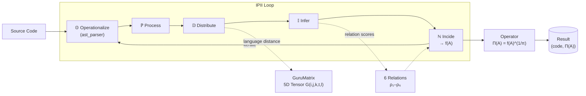

# $\pi\sqrt{f(A)}$: Hexarelational Significance Algebra for Algorithms

[](https://python.org)
[](LICENSE)
[](#)

🌐 **Language / Idioma:** [Português](README.md) · [English](README.en.md)

> **Implementation of the Hexarelational Significance Algebra for Algorithms.**  
> A framework for semiotic evaluation and iterative semantic transpilation (IPII) via a 5D GuruMatrix.

---

## Overview

This repository is a proof-of-concept / MVP of the **Hexarelational Significance Algebra**, a formal theory that assigns a *significance score* $\Pi(A)$ to any algorithm $A$ by applying a transcendental operator inspired by the work of **Leibniz**, **Peirce**, and **Ramanujan**.

The stack comprises:
- A **mathematical core** (`core/`) implementing the π-radical operator and the six significance relations.
- A **5D GuruMatrix** (`gurumatrix/`) — a NumPy tensor that catalogues computational patterns and learns from successful transpilations.
- An **IPII transpiler** (`ipii/`) that orchestrates iterative semantic transpilation from Python source code to multiple target languages (JavaScript, Rust, pseudocode, etc.).
- Optional **LLM integration** (OpenAI-compatible API) for scoring transpilation candidates.
- **Radar chart visualisation** of the six significance relation scores.

---

## Theoretical Summary

### The $\pi\sqrt{f(A)}$ Notation

The notation $\pi\sqrt{f(A)}$ — read as *"π-th root of f of A"* — is the foundation of a significance algebra for algorithms.

**Canonical Definition:**

$$\Pi : \textbf{Alg} \to \mathbb{R}_{\geq 0}$$

$$\Pi(A) := [f(A)]^{1/\pi} = [f(A)]^{\pi^{-1}}$$

where $\pi = 3.14159\ldots$ is the Archimedean constant and $\pi^{-1} = 0.31830\ldots$ is its multiplicative inverse.

The transcendental exponent $1/\pi$ guarantees **irreducibility**: the result cannot be expressed in finite closed form for most values of $f(A)$, conferring on the operator its property of *reinscription into the continuum*.

### Ontological Hierarchy

| Step | Expression | Role |
|------|-----------|------|
| 1 | $A$ | The algorithm — a finite sequence of instructions |
| 2 | $f(A)$ | The interpreted algorithm — placed in a significance context |
| 3 | $\sqrt{f(A)}$ | Extraction of the fundamental scale — compresses peaks, raises minima |
| 4 | $[f(A)]^{1/\pi}$ | Reinscription into the continuum — transition to the irrational domain |

### The Five Operative Modes

The function $f$ acts on algorithm $A$ through five modes (funtors) that form a communicating network:

| Mode | Symbol | Description |
|------|--------|-------------|
| Operationalize | $\mathbb{O}$ | Brings the algorithm to the real domain (source code → enriched AST) |
| Process | $\mathbb{P}$ | Transforms step by step, traverses and modifies state |
| Distribute | $\mathbb{D}$ | Allocates and spreads the result across domains and nodes |
| Infer | $\mathbb{I}$ | Derives implicit consequences (deduction, abduction, induction) |
| Incide | $\mathbb{N}$ | Projects the result onto the world — causal dimension |

### The Six Significance Relations

When $f$ evaluates $A$, the result is a significance profile across six hierarchical dimensions:

| Relation | Symbol | Properties | Symbolic Definition |
|----------|--------|------------|---------------------|
| Similitude | $\rho_1$ | Reflexive, Symmetric, **Non-transitive** | $x\,\rho_1\,y \iff d(\phi(x),\phi(y)) < \varepsilon$ |
| Homology | $\rho_2$ | Reflexive, Transitive, **Non-symmetric** | $x\,\rho_2\,y \iff \exists\, h: \text{Struct}(x) \xrightarrow{\sim} \text{Struct}(y)$ |
| Equivalence | $\rho_3$ | Reflexive, Symmetric, Transitive | $x\,\rho_3\,y \iff \forall C: C[x] \simeq C[y]$ |
| Symmetry | $\rho_4$ | Reflexive, Symmetric, Transitive | $x\,\rho_4\,y \iff \exists T \in \mathcal{G}: T(x)=y \wedge T^{-1}(y)=x$ |
| Equilibrium | $\rho_5$ | Symmetric, **Non-reflexive**, **Non-transitive** | $x\,\rho_5\,y \iff \Phi(x)+\Phi(y)=0$ |
| Compensation | $\rho_6$ | The most demanding — implies all of the above | Emergent value $>$ sum of parts |

### GuruMatrix and IPII

- **GuruMatrix:** A 5D tensor $G(i,j,k,t,l)$ cataloguing computational patterns across five dimensions: Ontological Category, Semantic Field, Hermeneutic Level, Execution Time, and Target Language.
- **IPII (Iterative Parametric Interaction by Interoperability):** Semantic transpilation protocol that orchestrates the 5 modes and evaluates transpilation quality using the 6 relations, maximising $\Pi(A)$.

---

## New Features

### Dynamic GuruMatrix

The GuruMatrix can now **learn and adapt** from successful transpilations.
After each IPII execution, `learn_from_transpilation` adjusts the tensor values at the coordinates corresponding to the identified pattern (ontological category + hermeneutic level inferred from the equivalence score + target language), creating a continuous improvement cycle.

The GuruMatrix can be persisted and reloaded via `save`/`load` (NumPy `.npy` format), allowing accumulated learning to survive across sessions.

```python
from gurumatrix.tensor import GuruMatrix

gm = GuruMatrix()

# After a successful transpilation:
gm.learn_from_transpilation(
    source_ast=enriched_ast,
    target_ast=transpiled_code,
    target_lang="javascript",
    pi_score=0.93,
    relation_scores=result.relation_scores,
)

# Save and reload
gm.save("gurumatrix.npy")
gm.load("gurumatrix.npy")
```

### LLM Integration in Infer Mode

The Infer mode ($\mathbb{I}$) can now delegate the scoring of transpilation candidates to a **Large Language Model** (LLM) via any OpenAI-compatible API. `LLMScorer` builds a structured prompt describing the original source code, the candidate, and the six significance relations — asking the LLM for a score from 0.0 to 1.0 and a brief justification. If the LLM is unavailable (missing key or package not installed), the system silently falls back to the internal heuristic scorer.

```python
import openai
from core.modes import LLMScorer, build_llm_scorer
from ipii.transpiler import SemanticTranspiler

# Option 1 — via OPENAI_API_KEY environment variable (automatic)
transpiler = SemanticTranspiler(
    llm_client=openai.OpenAI(),   # uses OPENAI_API_KEY from environment
)
result = transpiler.transpile(source_code, target_lang="javascript")

# Option 2 — convenience factory (detects key automatically)
scorer = build_llm_scorer(source_code, target_lang="javascript")
transpiler = SemanticTranspiler(scorer=scorer)
```

### Significance Profile Visualisation

`plot_significance_profile` generates a **radar chart** (*spider chart*) with the scores of the six significance relations (ρ₁–ρ₆) — each relation on one axis, on a scale from 0 to 1. A large, balanced polygon indicates a high-quality transpilation across all dimensions; deficient axes are visually apparent.

```python
from utils.visualization import plot_significance_profile

plot_significance_profile(
    result.relation_scores,
    title="Significance Profile — Python → JavaScript",
    filepath="significance_profile.png",   # None to display interactively
)
```

`SemanticTranspiler` can generate the chart automatically at the end of each transpilation:

```python
transpiler = SemanticTranspiler(
    visualization_filepath="/tmp/profile_{target_lang}.png",
)
```

---

## Architecture



### Module Map

```text
algebra-hexarrelacional/
├── core/
│   ├── operator.py      # Π(A) = [f(A)]^(1/π) + convergence theorem
│   ├── modes.py         # 𝕆 ℙ 𝔻 𝕀 ℕ — five operative modes + LLMScorer
│   └── relations.py     # ρ₁–ρ₆ — six significance relations
├── gurumatrix/
│   └── tensor.py        # GuruMatrix: 5D numpy tensor G(i,j,k,t,l) + learning + persistence
├── ipii/
│   ├── ast_parser.py    # Enriched AST with ontological metadata
│   └── transpiler.py    # SemanticTranspiler — IPII orchestration + LLM + visualisation
├── utils/
│   ├── __init__.py
│   └── visualization.py # plot_significance_profile — radar chart for ρ₁–ρ₆
├── examples/
│   └── semantic_transpilation.py  # End-to-end demo (LLM + radar chart + learning)
└── tests/
    ├── test_operator.py   # Convergence theorem proofs
    └── test_relations.py  # Formal property proofs (reflexivity, symmetry …)
```

---

## Installation

```bash
# Clone the repository
git clone https://github.com/marcabru-tech/algebra-hexarrelacional.git
cd algebra-hexarrelacional

# (Optional) create a virtual environment
python -m venv .venv
source .venv/bin/activate   # Windows: .venv\Scripts\activate

# Install runtime dependencies
pip install -r requirements.txt

# Install dev dependencies (required to run tests)
pip install -r requirements-dev.txt
```

### LLM Integration (optional)

To use the LLM integration (`openai`), install the extra dependencies and export your API key:

```bash
pip install -r requirements-llm.txt
export OPENAI_API_KEY="sk-..."   # or any OpenAI-compatible API
```

> **Note:** LLM integration is completely optional. Tests and the mathematical core work without `openai`.

---

## Usage

### Main example — semantic transpilation

```bash
# Default target: JavaScript
python examples/semantic_transpilation.py

# Custom target language
python examples/semantic_transpilation.py --target rust
python examples/semantic_transpilation.py --target pseudocode
```

### Python API

```python
from ipii.transpiler import SemanticTranspiler
from core.operator import pi_radical_significance, iterate_convergence

# Transpile a Python algorithm to JavaScript
transpiler = SemanticTranspiler(max_iterations=8, tolerance=1e-5)
result = transpiler.transpile(
    source_code="""
def factorial(n: int) -> int:
    if n <= 1:
        return 1
    return n * factorial(n - 1)
""",
    target_lang="javascript",
)

print(result.final_code)
print(f"Π(A) = {result.pi_A:.6f}")   # e.g. Π(A) = 0.948312
print(result.relation_scores)

# Demonstrate Theorem 6.2 — convergence of Π^n(A) → 1
trajectory = iterate_convergence(f_A=result.f_A, n_iterations=10)
for i, val in enumerate(trajectory):
    print(f"  Π^{i}(A) = {val:.8f}")
```

### GuruMatrix

```python
from gurumatrix.tensor import (
    GuruMatrix, OntologicalCategory, SemanticField,
    HermeneuticLevel, ExecutionTime, TargetLanguage,
)

gm = GuruMatrix()
dist = gm.calculate_language_distance(TargetLanguage.PYTHON, TargetLanguage.RUST)
print(f"Python→Rust significance distance: {dist:.4f}")

score = gm.get_pattern(
    OntologicalCategory.RECURSIVE,
    SemanticField.MATHEMATICS,
    HermeneuticLevel.SEMANTIC,
    ExecutionTime.EXPONENTIAL,
    TargetLanguage.PYTHON,
)
print(f"Pattern significance: {score:.4f}")
```

### Tests

```bash
pytest tests/ -v
```

---

## Mathematical Foundations

### Theorem 6.2 — Convergence of the π-Radical Operator

For any finite $f_A > 0$:

$$\lim_{n \to \infty} \Pi^{(n)}(A) = \lim_{n \to \infty} [f(A)]^{(1/\pi)^n} = 1$$

because $(1/\pi)^n \to 0$ and $x^0 = 1$ for all $x > 0$.  
Verified in `tests/test_operator.py::TestIterateConvergence::test_convergence_to_one`.

### Non-transitivity of $\rho_1$

Similitude is reflexive and symmetric but **not transitive**: there exist $x, y, z$ such that $\rho_1(x,y) > \varepsilon$ and $\rho_1(y,z) > \varepsilon$ but $\rho_1(x,z) \leq \varepsilon$.  
Documented in `tests/test_relations.py::TestSimilitude::test_not_transitive_in_general`.

---

## Citation

If you use this work in academic research, please cite:

```bibtex
@software{pi_root_f_A,
  title        = {$\pi\sqrt{f(A)}$: Hexarelational Significance Algebra for Algorithms},
  author       = {Guilherme Gonçalves Machado},
  year         = {2026},
  url          = {https://github.com/marcabru-tech/algebra-hexarrelacional},
  note         = {PoC/MVP of the semiotic evaluation and iterative semantic transpilation (IPII) theory via 5D GuruMatrix},
}
```

---

## License

Distributed under the **PolyForm Noncommercial 1.0.0** license. See [LICENSE](LICENSE) and [TERMS.md](TERMS.md) for full details.

- ✅ **Allowed:** personal use (study, hobby, experiment) and academic / public research use.
- ❌ **Prohibited:** any commercial use without prior written permission from the copyright holder.
- 💼 **Commercial licensing:** contact [guilhermemachado.ceo@hubstry.dev](mailto:guilhermemachado.ceo@hubstry.dev).

---

## Topics

`mathematics` · `semiotics` · `computational-linguistics` · `compiler-design` · `algebra` · `algorithm-analysis` · `transpiler` · `python` · `formal-methods`
